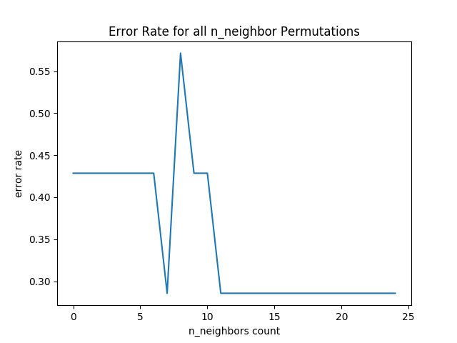

# Political Bias and Voting Trends

:warning: in review 

:warning: please do not rush to finish if you need a bit more time take it, that is not a problem .

:wave: I really want a discussion on why you think political data can be predicted using AI/ML, provide some resources and discuss why it is important to bridge politics and data driven politics. 

| Mercedes Olson      Jarod Saxberg 
| mercolso@iu.edu     jsaxberg@iu.edu
| Indiana University  
| hid: sp19-222-96    sp19-222-100
| github: [:cloud:](https://github.com/cloudmesh-community/sp19-222-100/blob/master/project-report/report.md)
| code: [:cloud:](https://github.com/cloudmesh-community/sp19-222-100/tree/master/project-code)

## Abstract

blah

## Introduction 

Sklearn's K-Nearest Neighbors algorithm was used to train a classifier which
determines if a presidential candidate would win or lose an election based on
their support or opposition to ten issues-healthcare, military, education, 
taxing the wealthy/businesses, women's rights, globalism, gun rights,
infrastructure, minority rights, and immigration. 

The goal of this project was to predict if a hypothetical candidate would win based off of what idea and views they supported for a specific ten issues. The issues include if the candidate supported healthcare, increase in spending on military, education, increase taxes on the wealthy, supporting women rights, globalism, gun rights, increase in infrustructure, minoity rights, and immigration. The reason behind this was to try and determine the political voting trends of the United States. The algorithm used was K Neareest Neighbor and the implimentation will later be discussed. 

:wave: avoid phrases like the goal of this project. 

## Requirements

what is needed to run:
- Docker within itself will download needed python libraries found from inside requirements.txt

## Design

The design of this project is quite simple for people to use. From a high-level
perspective, all a user needs to do is build a docker container and proceed to
the endpoints defined. To break this down, the project is split up into three 
parts: the python code containing the machine learning logic, the REST API 
connecting the python code to a website that can be navigated to, and a docker
container that houses all of the files necessary for the project. Below each
part will be discussed in more detail.

### Python

This project makes use of sklearn's K-Nearest Neighbors algorithm 
[@scikit-learn] to perform machine learning on the dataset. Sklearn allows easy
use of many machine learning algorithms. Using their K-Nearest Algorithm is as
simple as using the lines:

```python
classifier = KNeighborsClassifier(n_neighbors=5)
classifier.fit(x_train, y_train)

pred = classifier.predict(x_test)
```

With the use of that code, everything within the scope of this project can be
completed. When users pass their own hypothetical candidate with ten arguments,
the arguments are added to an array that is then passed through the predict
function and the classifier determines if the candidate would win or lose based
on the given arguments. 

### REST API

The REST API allows simple connection between backend python code and a
frontend website/API where users can pass data in and receive it back as a json
formatted object. People can easily access the classifier through the API
without the need to build it and run it on their own. Endpoints are 
developer-designed urls that can be navigated to so users can run the
classifier and other useful features. The basepath is what prefixes all other
endpoints; it can be thought of as a top level directory and all of the
endpoints are files within the directory structure. Below, the basepath and 
endpoints are listed.

BASE PATH:
- /cloudmesh/ai/voting
  - Prefixes all endpoints; for example, `/cloudmesh/ai/voting/run/test/0`.

END POINTS:
- /data/download/\<file\>.csv
  - Downloads the csv data file, named as the argument provided for file.
- /data/show/graph
  - Shows the graph generated from /run/neighbors
- /run/neighbors
  - Runs an analysis that determines the best argument for n_neighbors.
- /run/test
  - Runs an analysis with testing and training sets, also exports a graph.
- /run/custom/\<neighbors\>/\<healthcare\>/\<military\>/\<education\>/\<tax wealthy\>/\<womens rights\>/\<globalism\>/\<gun rights\>/\<infrastructure\>/\<minority rights\>/\<immigration\>
  - Allows user to perform classification with custom arguments.

### Docker

Docker containers were used in this project to create an image that held all of
the requirements to run this project. Containers are good to use because it 
eliminates the requirement of downloading all the necessary files to a personal
computer and allows them to be easily removed by deleting the image. It also
allows one common operating system--in this case, Ubuntu--to be used across all
projects, thus eliminating the troubles that can arise from a mixture of 
operating systems.

## Dataset

The dataset for this project had to be built from scratch as there were not any
easily accessible datasets with the features desired. In order to create the
dataset, google sheets was used to input data, and then the spreadsheet was
downloaded as a csv file. After converting the dataset to a csv file, it was 
then uploaded to a website that can be accessed through the python requests
library. The information obtained from the Federal Election Commissions [@fec] 
website included the top 4 presidential candidates based off the total votes 
and percentage of votes received from the years 1988 to 2016 with their 
respective parties. After selecting the candidates ten topics were chosen. The
topics include healthcare, military, education, taxing the wealthy, women's
rights, globalism, gun rights, infrastructure, minority rights, and immigration.
Each presidential candidate received a 1 or 0 if they supported or opposed a 
topic, based on research from the website OnTheIssues [@ontheissues] and 
wikipedia pages about the respective campaigns. An example would be if the 
candidate had a 0 in the 3rd element and 1 in the 5th element, their actions 
in the past show opposition to education and support for women's rights. One 
final thing to take into consideration when making this data is personal bias 
and the limitations of records can affect the results.   

## Results

It is difficult to draw conclusive results from this machine learning
application primarily because of the limited size of the dataset. There are
only 32 entries in the dataset, so the algorithm does not have a lot of data to
go on. Running the algorithm multiple times returns multiple different values 
for the precision, recall, and f1-score. It is primarily dependent on which 
entries are chosen for the testing and training datasets. The algorithm could
be improved with additional candidates dating further back from 1988, but the
farther back it goes, the less data is easily available.

Using the KNN algorithm from sklearn requires an argument for n_neighbors which
will affect the accuracy of the algorithm. A simple loop was developed to 
determine the best n_neighbor argument for each iteration of testing and
training datasets. The loop determined the error rate that each possible 
n_neighbor argument produced, and creates a graph plotting the n_neighbor 
argument against the error rate. Below is a sample graph generated by one 
iteration of the testing and training datasets.



## Discussion

Machine learning and artifical intelligence are both hot topics having grown
exponentially in popularity during the past ten years--many people are racing
to find new ways to apply these algorithms to real-world scenarios. An area of
interest for this project is how machine learning applies to politics, 
specifically data-driven politics. The application has been difficult, however.
As shown in Gayo-Avello, Metaxas, Mustafaraj 2011 [@gayo2011limits], it is 
difficult to draw correlations between analysis results and electoral outcomes.
Prior research has been done connecting measures of public opinion measured 
from polls with semtiment measured from text as shown in O'Connor et al. 2010 
[@o2010tweets], and it shows promise having correlations as high as 80%. The
research shows how sentiment from text could be used as a subsitute for typical
polling and predict movement in the polls; however, using Twitter as the source
for text nowadays would create issues as the amount of bots on Twitter has 
grown exponentially since this research was done in 2011.

## Conclusion

- reiterate results and accuracy, future endeavors/predictions (if any) 

## Work Breakdown

Going through candidates and creating the dataset was an even contriubtion from
both contributors. The coding aspect was spilt in a way that Jarod set up the 
KNN algorithm and Mercedes set up the training and testing part of the 
algorithm. The dockerfile was worked on by both authors, and running and
testing the docker containers was done on Mercedes's computer. The report was 
broken down in segments with Mercedes writing the initial outline and Jarod 
working on the abstact. Both colaborators worked evenly on writing and editing
the rest of the sections of the report. 

## Specification

```
swagger: "2.0"
info: 
  version: "0.0.1"
  title: "presidential support"
  description: "Attempts to determine how much support a candidate will receive based on their viewpoints"
  license: 
    name: "Apache"
host: "localhost:8080"
basePath: "/cloudmesh/ai/voting"
schemes: 
  - "http"
consumes: 
  - "application/json"
produces: 
  - "application/json"
paths:
  /run/custom/<neighbors>/<hlt>/<mil>/<edu>/<tax>/<wmr>/<glb>/<gnr>/<inf>/<mnr>/:
    get:
      tags:
        - RUN_CUSTOM
      operationId: run.run_custom
      description: "Runs an analysis based on given arguments"
      produces:
        - "application/json"
      responses:
        "200":
          description: "Run custom analysis"
          schema: {}
  /run/test:
    get:
      tags:
        - RUN_TEST
      operationId: run.run_test
      description: "Runs an analysis based on test/train data from dataset."
      produces:
        - "application/json"
      responses:
        "200":
          description: "Run test analysis"
          schema: {}
  /run/neighbors:
    get:
      tags:
        - RUN_NEIGHBORS
      operationId: run.neighbors
      description: "Determines best neighbor argument to use for KNN algorithm"
      produces:
        - "application/json"
      responses:
        "200":
          description: "Run neighbor search"
          schema: {}
  /data/download/<output>:
    get:
      tags:
        - DATA
      operationId: data.download
      description: "Downloads data from an external location"
      produces:
        - "application/json"
      responses:
        "200":
          description: "Data info"
          schema: {}
  /data/show/graph:
    get:
      tags:
        - DATA_GRAPH
      operationId: data.graph
      description: "Shows the graph generated from the neighbors endpoint"
      produces:
        - "application/png"
      responses:
        "200":
          description: "Show graph"
          schema: {}
```
